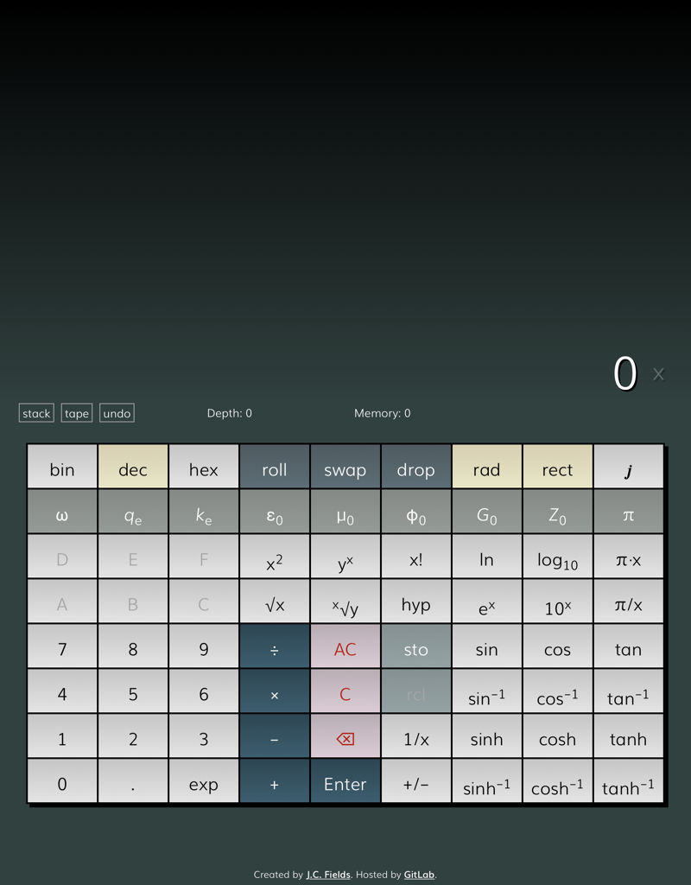

# ee-calc

An RPN calculator with complex number support. Written in JavaScript. It is designed solely for RPN (with no support for conventional infix notation) and supports complex numbers for all operations.

I wrote it because I wanted a calculator program for electrical engineering with first-class complex number support akin to the HP 35s scientific calculator and found the available options all lacking in different ways. It also improves upon the HP 35s itself in a few ways, such as being able to switch between bases, degrees/radians, and rectangular/polar forms much easier.

The calculator is missing some common functions that I think are not generally useful for engineering, such as octal numbers and binary logarithms, for the sake of reducing clutter.

It uses the [decimal.js](https://github.com/MikeMcl/decimal.js) library to handle numbers to avoid the usual floating point weirdness.

## Guide

### Basic operations

The calculator uses [reverse Polish notation](https://en.wikipedia.org/wiki/Reverse_Polish_notation) (RPN), in which the operators follow the operands. One benefit of RPN is that it obviates the need for parentheses. Instead of representing an equation as a "tree" of nested expressions, you reduce an equation to a simple stack of operations.

All of the calculator's functions can be classified as either a unary (requiring only one operand) or binary (requiring two operands) operation:

- Unary operations include square and square root, the logarithmic and trigonometric functions, and the exponential function. To execute a unary operation, you only need a number in the x register (the bottom-most row of the stack). For example, to compute the natural log of 2, you would type `2` and then press the `ln` key. The result will replace the value of x in the stack.
- Binary operations include the basic arithmetic operations—addition, subtraction, multiplication, and division—as well as the power and inverse power (nth root) functions.  They operate on two numbers, so you need a number in both the x and the y registers (the two bottom-most rows of the stack). For example, to add 2 and 3, you would type `2`, press `Enter` to push it into the stack, press `3`, and then press `+` to perform the addition operation. The result is calculated and both rows are combined into the result.

For a less trivial example, we can compute the [quadratic formula](https://en.wikipedia.org/wiki/Quadratic_formula) for a = 1, b = 6, and c = 9:

- We start by typing `6` and then press the `+/−` button to negate it. Then we press `Enter` to push it into the stack for later.
- Next we move onto the expression under the radical; since the calculator automatically puts the previous value into the new register, we can simply press `x²` to square it and `Enter` to push it into the stack.
-  Now we press `4` `Enter` `1` `Enter` `9` `Enter` to enter the rest of the expression. Then `*` twice will multiply the three terms, and `−` will subtract the result from the value we saved from earlier.
-  Then we press `√x` to calculate the square root of the result. Since this example only has one root, we can press either `+` or `−` to combine the terms.
- After an operation is performed, the next number automatically goes into a next register, so we can press `2` `1` `*` to enter the last portion. We end up with the numerator in the y register and the denominator in the x register, so we can press `/` to divide and calculate the final answer.

You can rearrange the order of the stack with the `roll` or `swap` buttons or remove the most recent entry with the `drop` button. The stack values are retained if the window is closed.

### Number bases

The calculator supports inputting and outputting numbers in the binary, decimal, and hexadecimal number bases, including for non-integer and complex numbers. To switch between number bases, press `bin`, `dec`, or `hex`. You can also use the `` ` `` key to cycle through them (or `Shift`+`` ` `` to cycle in reverse).

Binary and hexadecimal modes do not support exponential notation for especially small or large numbers. The fractional part will be truncated if it is too long, and very large numbers will overflow the display.

### Complex numbers

The calculator supports complex numbers for all operations in both rectangular (real and imaginary components) and polar form (magnitude and phase). To enter an imaginary or a complex number, use the `𝒋` (in rectangular mode) or `θ` (in polar form) button.

For example, to enter the imaginary number j8 in rectangular form, press `𝒋` `8`. To enter the same number in polar form, press `rect` to toggle it to `polar`, then enter `8` `θ` `90`. To enter the complex number 2 + j3, press `2` `𝒋` `3`.

You can change between rectangular and polar form at any time by toggling the `rect`/`polar` button. While in polar form, you can change between degrees and radians by toggling the `rad`/`deg` button.

### Memory

The calculator can store multiple entries in memory. There is no set limit for memory entries; they are stored in a queue (first in, first out) until recalled or removed. The memory queue is retained if the window is closed.

You can save the contents of the x register for later use using the `sto` button. This pushes it to the end of the memory queue. Holding the `Alt` key while pressing `sto` will replace the first memory item rather than adding a new one.

You can recall the first item in the queue back to a new register using the `rcl` button. This will also remove it from memory. Holding the `Alt` key while pressing `rcl` will restore the first memory item without removing it.

The contents of the memory queue are visible on the bottom of the screen, under the calculator buttons. The first item is highlighted in a lighter color. You can recall an item from memory by left-clicking it in this visible queue. This lets you recall an item out of order. If you right-click an item, it will be removed without pushing it back into the stack. Pressing the `Tab` key will rotate the memory queue, so you can change its order without recreating it; `Shift`+`Tab` rotates it in reverse.

Pressing the `Alt` key while using any binary stack operation (such as addition or multiplication) will perform the operation using the current value of the x register and the first memory entry and save its result back to the first memory entry. This can be used to increment (or otherwise manipulate) a number over a series of calculations without including it in the stack.

### Constants

The second row of the calculator is filled with constants useful for electrical engineering. Left-clicking any button will push its value into the stack.

Additionally, any constant can be edited by right-clicking its button. This will bring up a prompt allowing you to change the button symbol and title (mouse hover text). Surrounding characters in asterisks (`*`) will italicize it. The underscore (`_`) precedes subscript text; the caret (`^`) precedes superscript text.

When you press the `Save` button, it will modify these values as well as replacing the constant's numerical value with the value of the x register. You can use the `Reset` button to reset a constant to its default values. Custom constant values are retained after the window is closed.

There are also two special buttons to make it easier to insert values of pi. `π·x` multiplies the current number by pi; `π/x` divides pi by the current number. So to type the number π/4, you can type `4` `π/x`. These functions work on the individual component of the number (real or imaginary, magnitude or phase) rather than the number as a whole.

### Tape

The `Stack` button above the calculator shows the entire stack, including registers that have rolled off the visible area of the main display. The `Tape` button shows the history of numbers entered into the stack as well as operations performed.

The stack or tape opens by default as an overlay on top of the calculator. The `Pin` button moves it beside the calculator so it remains visible while the calculator is being used. This option is only available on landscape-oriented displays.

Using the `AC` (all clear) button on the calculator clears both the stack and the tape history.

The `Undo` button undoes the last operation in the tape (either a number being pushed into the stack or an operation being performed on it). Operations that are not saved to the tape, such as `Clear` or memory operations, cannot be undone.

### Hotkeys

There are a number of useful keyboard shortcuts to make calculations easier. You can see if a button has a hotkey by hovering the mouse pointer over it until the tooltip text appears.

Some of the more useful hotkeys:

#### Basic operations

| Key | Function |
| -- | -- |
| `/` | Divide |
| `*` | Multiply |
| `-` | Subtract |
| `+` | Add |
| `S` | Negate (−x) |
| `\` | Inverse (1/x) |

#### Stack

| Key | Function |
| -- | -- |
| `Enter` | Enter |
| `Backspace` | Backspace |
| `Esc` | Clear x |
| `Alt`+`Esc` | Clear entire stack |
| `Shift`+`Backspace` or `Del` | Drop x |
| `Left` or `Right` | Swap x and y |

#### Number bases

| Key | Function |
| -- | -- |
| `` ` `` | Cycle between number bases (`Shift` to reverse direction) |

#### Complex numbers

| Key | Function |
| -- | -- |
| `i` or `j` | Toggle real/imaginary input mode |

#### Memory

| Key | Function |
| -- | -- |
| `Tab` | Rotate memory queue (`Shift` to reverse direction) |
| `Shift`+`S` | Store to memory |
| `Shift`+`R` | Recall from memory |

#### Constants

| Key | Function |
| -- | -- |
| `P` | Insert pi (works even if `π` button is reassigned) |

#### Tape

| Key | Function |
| -- | -- |
| `T` | Show or hide tape |
| `Y` | Show or hide stack |
| `Ctrl`+`Z` | Undo (`Cmd`+`Z` on Mac) |

## Acknowledgments

Uses [decimal.js](http://mikemcl.github.io/decimal.js) library by [MikeMcl](https://github.com/MikeMcl) and contributors.

Uses [Muli](https://github.com/vernnobile/MuliFont) font by [Vernon Adams](https://github.com/vernnobile).

## Authors

- J.C. Fields <jcfields@jcfields.dev>

## License

- [MIT license](https://opensource.org/licenses/mit-license.php)

## See also

- [Bit Calc](https://github.com/jcfieldsdev/bit-calc)—A calculator I wrote to provide many of the basic bit operations omitted from this project.
